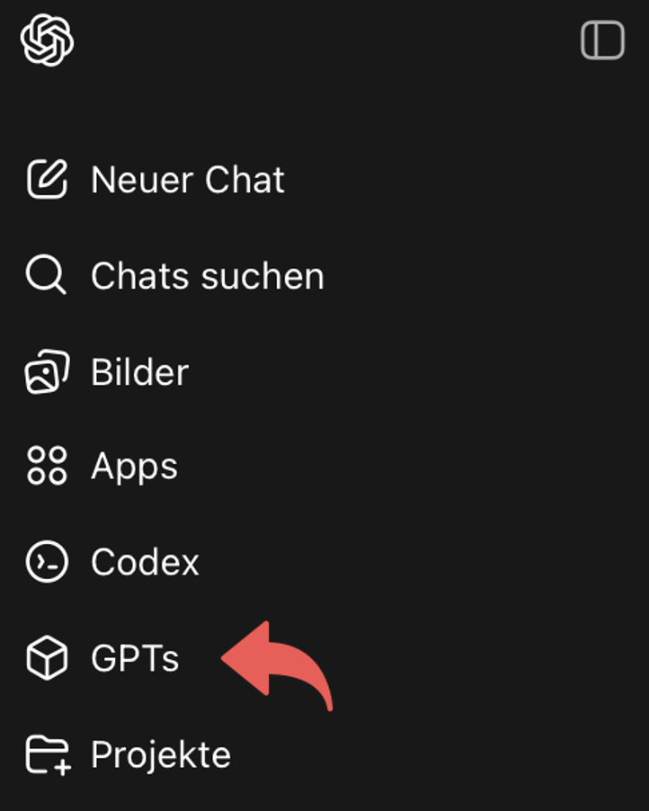
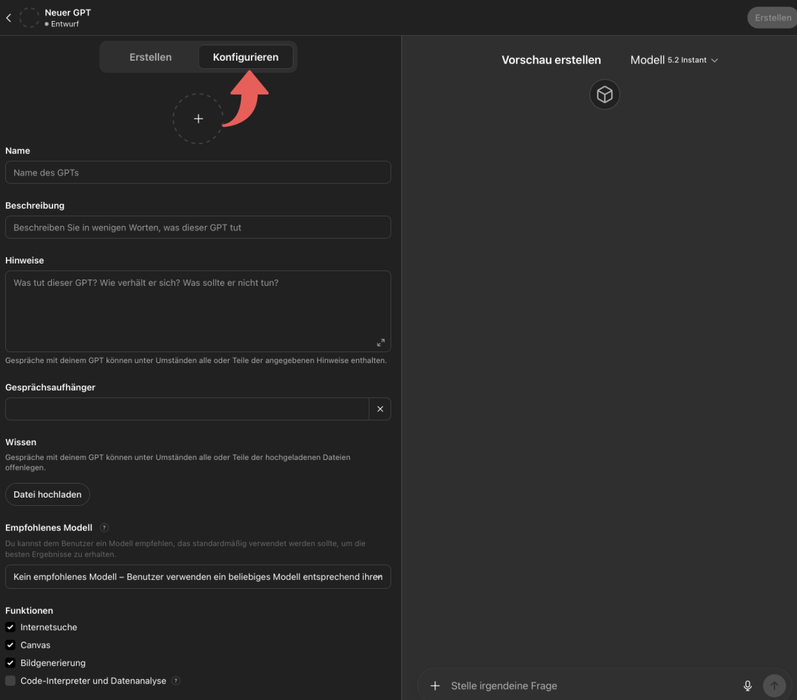

# CustomGPT – Datenschutzfreundlicher Angebotsassistent (Prototyp)

Dieses Repository dokumentiert den Prototypen eines CustomGPT, der aus strukturierten Kundenanfragen einen Angebotsentwurf erzeugt und dabei personenbezogene Daten konsequent anonymisiert.

## Was macht der Prototyp?
Der CustomGPT verarbeitet eine Anfrage in drei Schritten:
1. Anonymisierung (Entfernung von personenbezogenen Daten)
2. Strukturierung der Anfrage (Use Case, Leistungen, Rahmenbedingungen)
3. Erstellung eines Angebotsentwurfs auf Basis eines simulierten Produktkatalogs

Die Ausgabe erfolgt in drei Blöcken:
- **Block 1:** JSON (maschinenlesbar)
- **Block 2:** Tabelle (übersichtliche Angebotspositionen)
- **Block 3:** Text (Zusammenfassung und Hinweise)

## Prototyp nachbauen (Voraussetzungen & Schritte)

### Voraussetzungen
- Ein ChatGPT-Konto.
- **Zum Nachbauen/Erstellen des Custom GPT:** Zugriff auf den GPT-Builder (in der Regel mit **ChatGPT Plus/Pro** bzw. Team/Enterprise/Edu).
- Zugriff auf die Dateien aus diesem Repository:
  - `customgpt/systemprompt.txt`
  - `customgpt/wissenslog.txt`

### Schritt-für-Schritt (GPT-Builder)
1. Öffnen Sie https://chatgpt.com/ und klicken Sie in der linken Seitenleiste auf **„GPTs“**.
   

2. Klicken Sie oben rechts auf **„Erstellen“**, um einen neuen Custom GPT anzulegen.
   

3. Klicken Sie auf **„Konfigurieren“**.

5. 4. Kopiere den Inhalt aus `custom-gpt/systemprompt.txt` in das Feld **„Hinweise“**.
6. Lade unter **„Wissen“** die Datei `custom-gpt/wissenslog.txt` hoch.
7. Deaktiviere (falls vorhanden) Funktionen, die nicht benötigt werden (z. B. Internetsuche, Bildgenerierung).
8. Speichere den Custom GPT und öffne anschließend die **Vorschau** (rechts), um Tests durchzuführen.

> Hinweis: Die Ausgabe ist als 3-Block-Format definiert (JSON / Tabelle / Text). Der JSON-Block ist maschinenlesbar und dient als Referenz für die Testfälle in `tests/`.

## Repository-Inhalt
- `custom-gpt/` – Systemprompt und Wissenslog (Produktkatalog/Regeln)
- `tests/` – Testfälle (Eingaben/Ausgaben) inkl. Promptfallen
- `docs/` – Screenshots und zusätzliche Dokumentation
