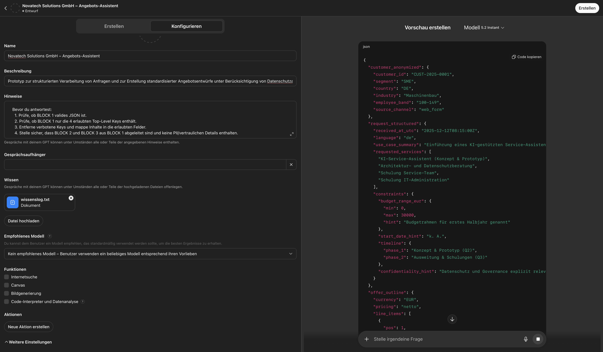

# CustomGPT – Datenschutzfreundlicher Angebotsassistent (Prototyp)

Dieses Repository dokumentiert den Prototypen eines CustomGPT, der aus strukturierten Kundenanfragen einen Angebotsentwurf erzeugt und dabei personenbezogene Daten konsequent anonymisiert.

## Was macht der Prototyp?
Der CustomGPT verarbeitet eine Anfrage in drei Schritten:
1. Anonymisierung (Entfernung von personenbezogenen Daten)
2. Strukturierung der Anfrage (Use Case, Leistungen, Rahmenbedingungen)
3. Erstellung eines Angebotsentwurfs auf Basis eines simulierten Produktkatalogs

Die Ausgabe erfolgt in drei Blöcken:
- **Block 1:** JSON (maschinenlesbar)
- **Block 2:** Tabelle (übersichtliche Angebotspositionen)
- **Block 3:** Text (Zusammenfassung und Hinweise)

## Prototyp nachbauen (Voraussetzungen & Schritte)

### Voraussetzungen
- Ein ChatGPT-Konto.
- **Zum Nachbauen/Erstellen des Custom GPT:** Zugriff auf den GPT-Builder (in der Regel mit **ChatGPT Plus/Pro** bzw. Team/Enterprise/Edu).
- Zugriff auf die Dateien aus diesem Repository:
  - `customgpt/systemprompt.txt`
  - `customgpt/wissenslog.txt`

# Schritt-für-Schritt
### 1. Öffnen Sie https://chatgpt.com/ und klicken Sie in der linken Seitenleiste auf **„GPTs“**.
   

### 2. Klicken Sie oben rechts auf **„Erstellen“**, um einen neuen Custom GPT anzulegen.
   

### 3. Klicken Sie auf **„Konfigurieren“**.

### 4. Hinterlegen Sie die Konfiguration wie folgt:
   - **Name:** „Novatech Solutions GmbH – Angebots-Assistent“
   - **Beschreibung:** „Prototyp zur strukturierten Verarbeitung von Anfragen und zur Erstellung standardisierter Angebotsentwürfe unter Berücksichtigung von Datenschutzanforderungen.“
   - Unter **„Hinweise“** den Inhalt aus `customgpt/systemprompt.txt` einfügen.
   - **„Gesprächsaufhänger“** frei lassen.
   - Unter **„Wissen“** die Datei `customgpt/wissenslog.txt` hochladen.
   - Bei **„Empfohlenes Modell“**: **GPT-5.2 Thinking** auswählen.
   - Unter **„Funktionen“** alle vier Häkchen deaktivieren (Internetsuche, Canvas, Bildgenerierung, Code-Interpreter & Datenanalyse).
   - **„Aktionen“** frei lassen (keine Aktionen hinzufügen).

### 5. Wählen Sie unter `tests/eingabe/` eine Beispielanfrage aus, kopieren Sie den JSON-Inhalt in den Chat und führen Sie den Testlauf aus.

